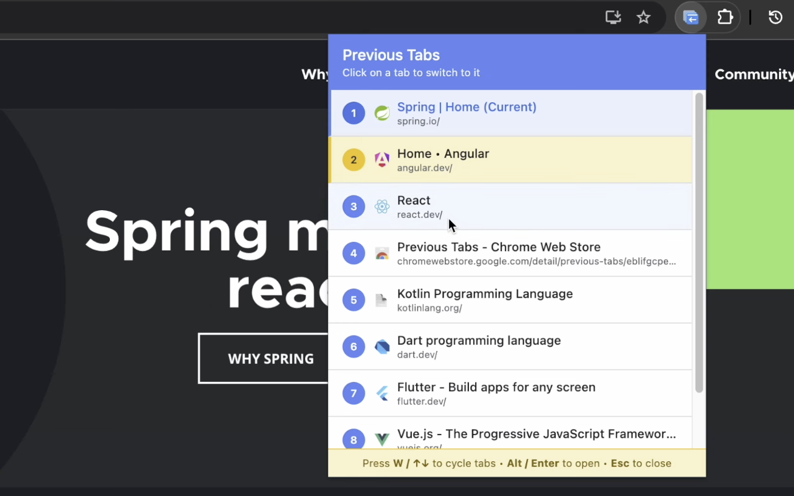

# Previous Tabs - Chrome Extension

  

Download: [Chrome Web Store](https://chromewebstore.google.com/detail/eblifgcpecjmbddmmaipjccdeednjeam?utm_source=item-share-cb)

Quickly switch between your currently open tabs based on which ones you used most recently. 

This extension tracks the order you activate tabs and lets you jump back to previously used tabs with keyboard shortcuts or a visual popup interface.

[Watch the demo on Youtube](https://www.youtube.com/watch?v=hwY9kmJ0rws)

## Features

  

- **Recent Tab Switching**: See all your currently open tabs sorted by most recently used
- **Keyboard Navigation**: 
    - `Alt + W` to open the popup, 
    - `W` or `↑↓` to cycle through tabs
    - `Enter` or `Alt` to switch to the selected tab
    - `Esc` to close the popup if you change your mind
- **Quick Switching**: Jump to any open tab with just a few keystrokes
- **Tab Information**: View tab titles, URLs, and favicons at a glance
- **Current Tab Indicator**: Easily identify which tab you're currently on (highlighted in blue)
- **Automatic Tracking**: Automatically tracks the order you activate your open tabs (up to 100)
- **Clean UI**: Modern, intuitive interface with visual feedback
- **Persistent Across Sessions**: Remembers tab activation order even after browser restart (only for tabs that are still open)

## How to Use

### Using Keyboard Shortcut (Recommended)

1. Press `Alt+W` to open the previous tabs popup
2. Press `W` or `↓` to cycle forward through tabs (or `↑` to go backward)
3. Press `Enter` or `Alt` to switch to the selected tab
4. Press `Esc` to close the popup

### Using Extension Icon

1. Click the "Previous Tabs" extension icon in your Chrome toolbar
2. The popup shows all your currently open tabs sorted by most recently used
3. Click on any tab to switch to it directly

## Installation

### From Chrome Web Store
1. Go to the [Chrome Web Store page](https://chromewebstore.google.com/detail/eblifgcpecjmbddmmaipjccdeednjeam?utm_source=item-share-cb)
2. Click "Add to Chrome"
3. Confirm by clicking "Add extension"

### From Source

1. Clone or download this repository
2. Open Chrome and go to `chrome://extensions/`
3. Enable "Developer mode" in the top-right corner
4. Click "Load unpacked"
5. Select the `previous_tabs` folder

## Workflow Example

1. Press `Alt + W` → Opens popup showing all currently open tabs sorted by recent usage
2. Press `W` three times → Cycles selection to the 4th most recently used tab
3. Press `Enter` → Switches to that tab
4. Or simply click on any tab in the list to switch to it immediately

**Visual Indicators:**
- **Blue highlight**: Current active tab
- **Yellow highlight**: Selected tab (when cycling with keyboard)
- **Numbers**: Show tab order (1 = most recently used, 2 = second most recently used, etc.)

**Note**: Only shows tabs that are currently open. Closed tabs are automatically removed from the list.

## Privacy

This extension is completely privacy-friendly:
- **No data collection**: Does not collect, store, or transmit any personal data
- **Local storage only**: Only stores tab IDs (internal Chrome identifiers) for currently open tabs
- **No external communication**: Never sends data to any external servers
- **No browsing history**: Does NOT track or access your browsing history - only tracks which of your currently open tabs you've recently switched to
- All data is stored using `chrome.storage.local` and remains on your device
- Closed tabs are automatically removed from storage

See [privacy_policy.md](privacy_policy.md) for full details.

## License

MIT License - Feel free to use and modify as needed.

## Contributing

Contributions are welcome! Feel free to submit issues or pull requests.
